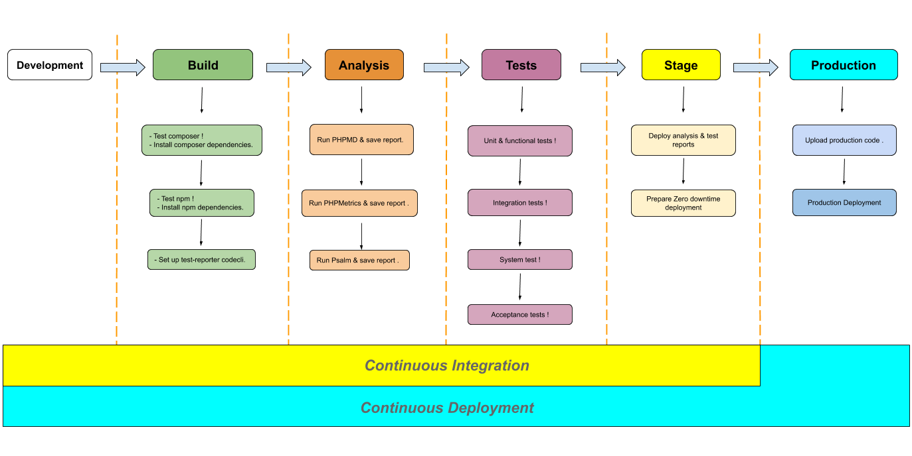

# Continuous Deployment

[Back to summary](../index.md)

* **Continuous integration** or CI is a process that automatically integrates software changes, verifies the quality of these changes by running tests and reports errors immediately.

* **Continuous deployment** goes one step further than *continuous integration*. With this practice, every change that passes all stages of the production pipeline is released to customers. There's no human intervention, and only a failed test will prevent a new change to be deployed to production.

_Continuous Deployment is ensured by a [**Circleci**](https://circleci.com/)_

**Continuous deployment** is an excellent way to accelerate the feedback loop with customers and take pressure off the team as there isn't a Release Day anymore. Development teams can now move faster ahead on their projects while in the background CI/CC is taking care of additional tasks.

[Go to automated Workflow](workflow.html "Workflow")